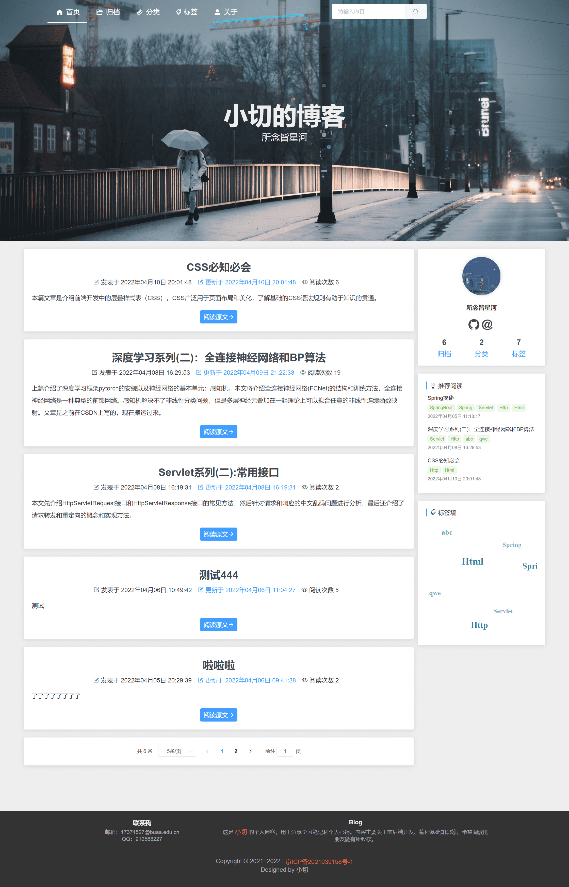
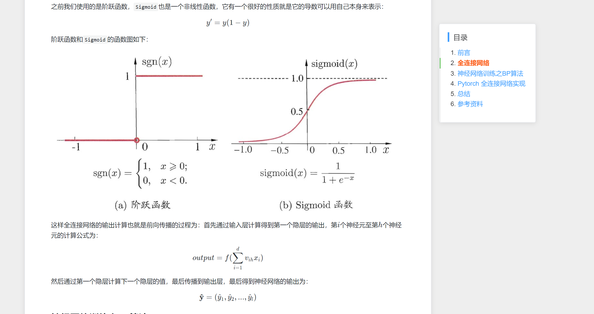
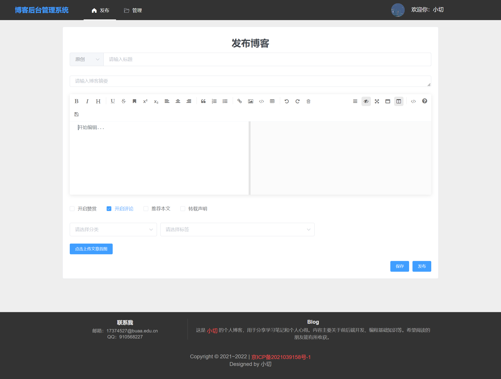
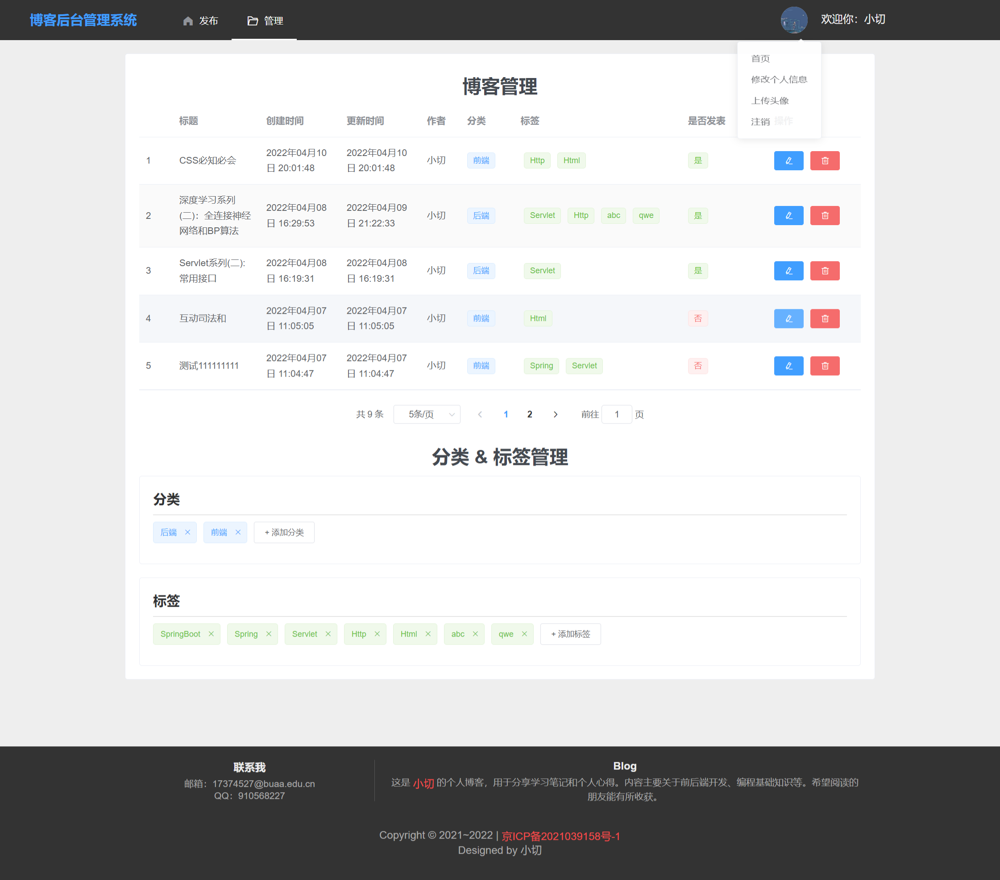

# Tiny-Blog

## Introduction

Tiny-Blog 是一个简洁的个人博客系统，本项目为前端部分，使用 vue2 + vue-router 开发，后端采用 SpringBoot 开发：[Tiny-Blog-Server 项目地址](https://github.com/xiaoqieF/Tiny-Blog-Server)。  

Tiny-Blog 主要支持的功能有：

- [x] 博客上传(Markdown语法上传)
- [x] 博客管理(标签管理、分类管理、编辑、删除等)
- [x] 首页博客预览
- [x] 博客详情(支持代码高亮、公式渲染)
- [x] 评论功能
- [x] 博客归档
- [x] 博客分类
- [x] 博客标签
- [x] 关于

## Example

首页：  

  

博客详情：  

  

后台管理页面：  

  
  

全部页面：[screenshots](./screenshots/)

## Usage

**注意：本项目仅为前端项目，运行此项目之前，需要先保证[Tiny-Blog-Server 项目](https://github.com/xiaoqieF/Tiny-Blog-Server)的运行。**

```
git clone git@github.com:xiaoqieF/Tiny-Blog.git

cd Tiny-Blog

npm install

npm run serve
```

node版本需要支持 ES6 特性。

## 说明

目前版本已经将基本功能开发完成，但尚未经过充分测试，且有些功能不是很完善，如用户管理、评论删除等。  

这些问题将在不久后得到修复。